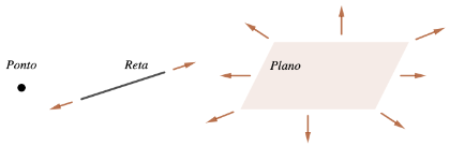

# Primeiras Noções

## Ponto, Reta e Plano

Nesta primeira parte do curso estudaremos a geometria analítica plana. 
Os principais objetos desta parte são os **pontos** e as **retas** e todos eles *"vivem"* num *único* **plano**. 

Algumas características intuitivas de tais objetos são:

- O plano, as retas, bem como os demais conjuntos não vazios são formados por pontos.

- **Ponto não tem espessura:** Embora um ponto seja esboçado como um pequeno círculo preenchido, para que possamos visualizá-lo, devemos entender que o ponto não é todo circulo mas apenas a parte central dele, sem espessura.

- **Reta não é limitada:** Intuitivamente, uma reta é uma linha sem ondulações que se prolonga indefinidamente. Claramente, não temos espaço para desenhar uma reta completamente, portanto apenas desenhamos uma parte dela, entendendo que ela se prolonga.
  
- **Plano não é limitado:** De forma similar a retas, o plano é uma superfície sem ondulações que se prolonga indefinidamente. Como antes, por falta de espaço, visualizamos apenas uma parte do plano, como por exemplo, uma a folha de papel ou o quadro da sala de aula, mas entendemos que o plano representado por eles se prolonga indefinidamente em todas as direções.
  
::: {#fig-ponto-reta-plano}

As setas indicando que a reta e o plano se prolongam não serão mais desenhadas daqui por diante.
:::

- Todo ponto tem posição fixa em relação aos demais! Não se move! 

::: {#def-variavel-pontual}
Uma variável que assume o lugar de qualquer ponto de um certo subconjunto não vazio $\mathcal{C}$ do plano é dita uma **variável pontual em $\mathcal{C}$.**  
:::

::: {#wrn-ponto-movel .callout-warning title="Cuidado!"} 
Na literatura é comum se encontrar expressões como: 

- Seja $P$ um ponto móvel em um conjunto $\mathcal{C}$,  ou 
- Seja $P$ um ponto que se move sobre um conjunto $\mathcal{C}$

Nestes casos $P$ não é um ponto no sentido estrito, mas sim uma variável pontual.  
:::

::: {.callout-caution title="Cuidado!"} 
Na literatura é comum se encontrar expressões como: 

- Seja $P$ um ponto móvel em um conjunto $\mathcal{C}$,  ou 
- Seja $P$ um ponto que se move sobre um conjunto $\mathcal{C}$

Nestes casos $P$ não é um ponto no sentido estrito, mas sim uma variável pontual.  
:::

***Acrescentar aqui?***

- semirretas! 
- segmentos aqui ?

## Posições Relativas Entre Retas

### Definição

Duas retas $r$ e $s$ no plano podem ter três tipos de **posições relativas** entre elas. Elas podem ser:

- **Coincidentes**: quando são iguais, isto é, $r=s;$
- **Paralelas**: quando não se intersectam, isto é, $r\cap s=\varnothing.$ Neste caso, denotamos $r\parallel s;$
- **Concorrentes**: quando se intersectam em um ponto, isto é, $r\cap s=\{P\}.$

# Distância

**Começar com ideia intuitiva "usando fita métrica"**

### Notação
Fixada uma unidade de comprimento, a **distância entre os pontos** $A$ e $B$ será denotada por $d(A,B)$. Em geral a unidade de medida não será mencionada, mas fica subentendido que uma unidade foi escolhida.

### Proposição

Valem as seguintes propriedades:

1. A distância nunca é negativa. 
$$ d(A,B)\ge0; $$
2. A distância zero quando os pontos são iguais e apenas neste caso.
    $$ d(A,B)=0\Leftrightarrow A=B;$$
3. Medir a distância entre $A$ e $B$ é o mesmo que medir a distância entre $B$ e $A$. 
   $$d(A,B)=d(B,A);$$
4. $d(A,B)+d(B,C)\ge d(A,C)$;
5. $d(A,B)+d(B,C)=d(A,C)\Leftrightarrow$ $A$, $B$ e $C$ são colineares e $B$ está entre $A$ e $C$.

A propriedade 4 acima é conhecida como **desigualdade triangular** e a propriedade 5 é um caso particular dela. Tais propriedades expressam geometricamente que o caminho mais curto de um ponto a outro é em linha reta.

**Exemplo**

Mova os pontos no applet abaixo e perceba que temos três desigualdades triangulares em um mesmo triângulo.  Coloque um dos pontos sobre o lado oposto e observe que a propriedade 5 só vale em um dos três casos.

<!--

-->

  <iframe
    src="https://www.geogebra.org/material/iframe/id/nep5hngs/width/800/height/500/border/888888/rc/false/ai/false/sdz/true"
    width="800"
    height="500"
    style="border:0;"
    allowfullscreen>
  </iframe>

