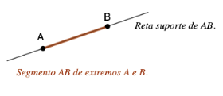
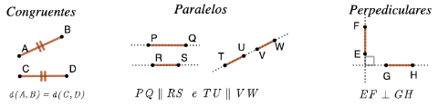
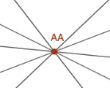

# Segmentos

::: {.bloco-objetivo}
Reconhecer um segmento de reta, seus extremos e sua reta suporte; calcular seu comprimento; identificar segmentos congruentes, paralelos e perpendiculares e o segmento degenerado.
:::

::: {.bloco-pre-requisitos}
Ponto, reta e distância entre dois pontos ([Primeiras Noções](01-primeiras-nocoes.qmd)).
:::

Introduzir rapidamente e exemplificar com figura,  a noção primitiva de um ponto **estar entre** dois pontos.

::: {#def-segmento}
Dados dois pontos distintos $A$ e $B$, sabemos que existe uma única reta $r$ que passa por eles. Chamamos de **segmento de reta** $AB$, ou simplesmente, **segmento** $AB$ ao conjunto formado pelos pontos $A$ e $B$ e pelos pontos da reta $r$ que estão entre $A$ e $B$.

Neste contexto, a reta $r$ é chamada de **reta suporte** do segmento $AB$ e os pontos $A$ e $B$ são chamados de **extremos do segmento** $AB$.
:::

Note que se um ponto $P$ está entre $A$ e $B$, segue que ele também está entre $B$ e $A$, portanto vale que  $AB=BA$.

::: {.fig-leg #fig-segmentos}
{fig-alt="Reta suporte passando pelos pontos A e B; o trecho da reta entre A e B, destacado, é o segmento AB."}

Segmento $AB$ de extremos $A$ e $B$ e sua reta suporte.
:::

::: {#def-comprimento-segmento}
O **comprimento** ou o **tamanho** de um segmento é a distância entre seus extremos, ou seja, o comprimento do segmento $AB$ é  $d\left(A,B\right)$.
:::

Na definição abaixo apresentamos algumas relações importantes entre dois segmentos. 

::: {#def-relacoes-segmentos}
Dois segmentos $AB$ e $CD$ são ditos:

- **Congruentes:** Se eles tem mesmo comprimento, isto é $d\left(A,B\right)=d\left(C,D\right)$.
- **Paralelos** ou com **mesma direção**: Se suas retas suporte são paralelas ou a mesma. Neste caso denotamos $AB\parallel CD$.
- **Perpendiculares** ou **ortogonais**:  Se suas respectivas retas suporte forem perpendiculares. Neste caso denotamos  $AB\perp CD$.
:::
 
::: {.fig-leg #fig-segmentos-posicao-relativa}
{fig-alt="Três pares de segmentos. Congruentes: AB e CD com o mesmo comprimento, d(A,B) = d(C,D). Paralelos: PQ e RS em retas paralelas, e TU e VW na mesma reta. Perpendiculares: EF e GH em retas que formam ângulo reto."}

A figura representa as três relações entre segmentos descritas acima.
:::

Chamamos de segmento **degenerado** $AA$ ao conjunto formado apenas pelo ponto $A$.

::: {.fig-leg .w30 #fig-segmento-degenerado}
{fig-alt="Várias retas passando pelo mesmo ponto A, que representa o segmento degenerado AA."}

O segmento degenerado $AA$ está contido em infinitas retas.
:::

Note que ao contrário do que ocorre com os segmentos “não degenerados” definidos acima, que estão contidos em uma única reta, os segmentos degenerados estão contidos em infinitas retas.

::: {.bloco-erro}
Não confunda o **segmento** $AB$, que é um conjunto de pontos, com o seu **comprimento** $d(A,B)$, que é um número, nem com a **reta** que passa por $A$ e $B$, que não tem extremos.
:::

::: {.bloco-applet}
**Segmento com extremos móveis.** Observe como o segmento e o seu comprimento mudam quando os extremos se movem.

Arraste os pontos $A$ e $B$ com o mouse ou o dedo. Pelo teclado, use Tab para selecionar um ponto e as setas para movê-lo. Os pontos se movem sobre a malha, e a posição e o comprimento aparecem em texto abaixo do quadro.


:::

::: {.bloco-checkpoint}
Leve o ponto $B$ até o ponto $A$. O que acontece com o segmento e com o seu comprimento? Em quantas retas esse segmento está contido?

::: {.callout-note title="Resposta" collapse="true"}
Quando $B=A$, o segmento se reduz ao ponto $A$: é o segmento degenerado $AA$, de comprimento $d(A,A)=0$. Ele está contido em infinitas retas, todas as que passam por $A$.
:::
:::

::: {#exrr-coprimento-segmento-deg}
O comprimento de um segmento não degenerado pode ser zero? 
:::

::: {.callout-note title="Resolução" collapse="true"}   
 Não. Pois se $AB$ é um segmento não degenerado então  $A\neq B$, e portanto $d\left(A,B\right)>0$, o que significa que o comprimento de $AB$ não é zero! 
:::
