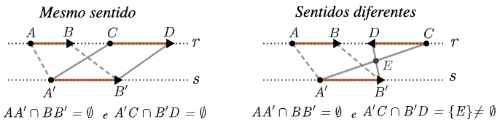

# Segmentos Orientados

Lembremos que dada uma reta r que passa pelos pontos A e B,  definimos o **segmento de reta AB** como o conjunto formado pelos pontos $A$ e $B$ e pelos pontos na reta r que estão entre $A$ e $B$. Agora vamos introduzir a noção de **segmento orientado**. **** 

::: {#def-segmento-orientado}
Um **segmento orientado** é um segmento não degenerado acrescido de um sentido de percurso. Mais precisamente, o segmento orientado $AB$ é dado pelo segmento $AB$, onde $A$  é chamado de **ponto inicial** e $B$ é chamado de **ponto final**, dando a indicação de que o sentido de percurso é do ponto $A$ para o ponto $B$.
:::

Em segmentos orientados o ponto final é representado pela ponta da seta como mostra a figura abaixo.

<!--  --- IGNORE -->

Seguido o raciocínio acima, o segmento orientado  $BA$  tem ponto inicial $B$ e ponto final $A$ , logo o sentido de percurso é de $B$ para $A$. Portanto, para segmentos orientados,  $AB \neq BA$  , ao contrário do que ocorre com segmentos *“não orientados”*,  onde  $AB = BA$.  

Precisamos definir agora a noção de sentido entre segmentos orientados.

::: {#def-sentido-semento}
Intuitivamente, os segmentos orientados $AB$ e $CD$ tem o **mesmo sentido** se ambos  são paralelos e apontam para o "*mesmo lado*".

Note que se os segmentos orientados não tiverem mesma direção, ou seja,  não forem paralelos, então seus sentidos são automaticamente **diferentes**.

Nos casos em que os segmentos orientados são paralelos mas de sentidos diferentes, também dizemos que eles tem **sentidos opostos**.
:::

<!--

-->

Vejamos uma outra forma de definir segmentos orientados com mesmo sentido que também aparecem em alguns livros: 

::: {#def-sentido-semento-formal}
Dois segmentos orientados  $AB$  e $CD$  tem o **mesmo sentido**  se  eles são paralelos e vale um dos casos:

**Caso 1:** Se $AB$ e $CD$ não tem mesma reta suporte:
O segmento  $AC$ (*obtido ligando o ponto inicial com ponto inicial*)  e o segmento $BD$ (*obtido ligando ponto final com ponto final*) não se intersectam, isto é,  $AC \cap BD = \emptyset$. 

<!--

-->

**Caso 2:**  Se $AB$ e $CD$ tem mesma reta suporte $r$:

Vamos usar um artificio para aplicar o caso 1.  Tome uma reta   $s$   paralela à reta  $r$ e sobre   $s$    considere um segmento  $A'B'$  que tenha mesmo sentido que $AB$ de acordo com o caso 1.  Neste caso, $AB$ e $CD$ terão o mesmo sentido se $CD$ também tem o mesmo sentido de  $A’B’$ de acordo com o caso 1.

:::
