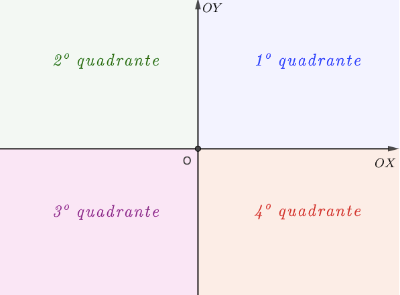

# Coordenadas no plano

Na seção anterior vimos, através da noção de eixo, que cada ponto de uma reta pode ser representado por um número. Agora veremos um método para representar cada ponto do plano através de números, mas neste caso, cada ponto será representado por um par ordenado de números.

::: {#def-sistema-eixos-ortogonais}
Um **sistema de coordenadas cartesianas** ou um **sistema de eixos ortogonais** $OXY$ no plano consiste em um par de eixos com mesma origem, $OX$ e $OY$ que se interceptam perpendicularmente na origem $O$. Assumiremos sempre que os dois eixos possuem coordenadas dadas na mesma unidade de medida.
:::

Fixado um sistema de coordenadas $OXY$, podemos associar cada ponto $P$ do plano com um único par ordenado de números reais $\left(x,y\right)\in\mathbb{R}^2$, chamados de **coordenadas** de $P$, da seguinte forma:

- Tome a reta $p_X$ que é perpendicular ao eixo $OX$ e passa pelo ponto $P$  e tome $X=OX\cap p_X$.
- Tome a reta $p_Y$ que é perpendicular ao eixo   $OY$  e passa pelo ponto P  e tome  $Y=OY\cap p_Y$.
- As coordenadas de $P$ são dadas pelo par $\left(x,y\right )$, onde $x$ é a coordenada de $X$ no eixo $OX$ e $y$ é a coordenada de $Y$ no eixo  $OY$. Neste caso escrevemos  $P=\left ( x,y\right )$.

Veja a ilustração:

  <iframe
    src="https://www.geogebra.org/material/iframe/id/ykdu6wtk/width/800/height/500/border/888888/rc/false/ai/false/sdz/true"
    width="800"
    height="500"
    style="border:0;"
    allowfullscreen>
  </iframe>

<!--

-->

Usualmente chamamos o eixo $OX$ de eixo das **abcissas** e o eixo $OY$ de eixo das **ordenadas**. Além disso, a menos que seja dito o contrário, o eixo $OX$ é o eixo horizontal e o eixo $OY$ é o eixo vertical.

Fixado um sistema de coordenadas ortogonais OXY, o plano é decomposto nos eixos OX e OY e em quatro quadrantes definidos como segue:

- $1^o$ quadrante = $\left\{(x,y)\in\mathbb{R}^2|\,\,\, x>0,y>0\right\}$
- $2^o$ quadrante = $\left\{(x,y)\in\mathbb{R}^2|\,\,\, x<0,y>0\right\}$
- $3^o$ quadrante = $\left\{(x,y)\in\mathbb{R}^2|\,\,\, x<0,y<0\right\}$
- $4^o$ quadrante = $\left\{(x,y)\in\mathbb{R}^2|\,\,\, x>0,y<0\right\}$

Note que os eixos não fazem parte dos quadrantes.

::: {#prp-formula-distancia}
A distância entre os pontos $P$ e $Q$ é dada por
$$ d\left(P,Q\right)=\sqrt{\left(x_P-x_Q\right)^2+\left(y_P-y_Q\right)^2}
$$
:::

  <iframe
    src="https://www.geogebra.org/material/iframe/id/pbfm8wna/width/800/height/500/border/888888/rc/false/ai/false/sdz/true"
    width="800"
    height="500"
    style="border:0;"
    allowfullscreen>
  </iframe>

<!--

-->

::: {#exm-distancia1}
Determine a distância do ponto $A=(1,-1)$ até o ponto $B=(-2,1)$.

- $\leftarrow$ Click para ver a solução
- 
$d(A,B)=\sqrt{(1-(-2))^2+(-1-1)^2}=\sqrt{3^2+2^2}=\sqrt{13}$
:::

::: {#exm-distancia2}
Determine os pontos sobre o eixo $OX$ que distam $\sqrt{2}$ do ponto $A=(1,1)$.

- $\leftarrow$ Click para ver a solução

Se $P\in OX$ temos $P=(x,0)$. Portanto

$\sqrt{2}=d(P,A)=\sqrt{(x-1)^2+(0-1)^2}\Rightarrow2=(x-1)^2+1$.

Resolvendo a última equação obtemos $x=0$ ou $x=2$. Assim temos duas soluções para o problema:
$$ P=(0,0) \text{ ou } P=(2,0). $$
:::

::: {#prp-formula-ponto-medio}
O ponto médio $M$ do segmento $PQ$ tem coordenadas dadas por 
$$ M=\left(\frac{x_P+x_Q}{2},\frac{y_P+y_Q}{2}\right)
$$
:::

::: {#exm-ponto-medio1}

Se $A=\left(3,-1\right)$ e $M=\left(-1,1\right)$ é o ponto médio de $AB$, determine o ponto $B$.

- $\leftarrow$ Click para ver a solução

Como $M=(-1,1)$ é ponto médio de $A=(3,-1)$ e $B=(x_B,y_B)$, de acordo com a Proposição 2, temos que

$(-1,1)=\left(\dfrac{3+x_B}{2},\dfrac{-1+y_B}{2}\right)$, donde  $-1=\dfrac{3+x_B}{2}$ e $1=\dfrac{-1+y_B}{2}$. Resolvendo as duas últimas equações obtemos $x_B=-5$ e $y_B=3$, logo $B=(-5,3)$.
:::
