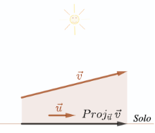

# Projeção Ortogonal

::: {#def-projecao-ortogonal}
Dados vetores $\vec{u}$ e $\vec{v}$, com $\vec{u}\ne\vec{0}$, definimos a projeção ortogonal de $\vec{v}$ em $\vec{u}$ como sendo o vetor dado por

$$
 {Proj}_{\:\vec{u}}\: \vec{v} = \frac{\langle \vec{v},\vec{u}\rangle}{\norm{\vec{u}}^2}\vec{u}.
$$
:::

**Exemplo**

Por exemplo, se $\vec{u}=(1,1)$ e $\vec{v}=(2,3)$ temos
$$
{Proj}_{\:\vec{u}}\:\vec{v}  =\frac{\langle (2,3), (1,1) \rangle}{\norm{(1,1)}^2}(1,1)=\frac{5}{2}(1,1)=\left(\frac{5}{2},\frac{5}{2}\right).
$$

## **Interpretação Geométrica da Projeção Ortogonal.**

Intuitivamente, se imaginarmos que o vetor $\vec{u}$ é paralelo ao "solo" então o vetor ${ Proj}_{\:\vec{u}}{\:\vec{v}}$  corresponde a "sombra" que o vetor $\vec{v}$ projeta no solo ao meio dia.

Além disso, se os vetores  $\vec{u}$  e  $\vec{v}$  não forem paralelos nem perpendiculares, então os vetores ${ Proj}_{\:\vec{u}}{\:\vec{v}}$ e $\vec{v}- { Proj}_{\:\vec{u}}{\:\vec{v}}$  podem ser representados sobre os catetos de um triângulo retângulo tendo  $\vec{v}$  sobre a hipotenusa.



Em particular, se $\vec{v}\neq\vec{p}= { Proj}_{\:\vec{u}}\:\vec{v}$  , isto é,  se $\vec{v}- { Proj}_{\:\vec{u}}\:\vec{v} \neq \vec{0}$, observamos, na representação acima, que $\vec{v}- { Proj}_{\:\vec{u}}\:\vec{v} \perp \vec{u}$. Esta propriedade está descrita no item 2 da próxima proposição.

::: {#prp-propriedades-projecao-ortogonal}
Nas condições da definição acima valem as seguintes propriedades.

1. Se ${ Proj}_{\:\vec{u}}\:\vec{v} \neq \vec{0}$ então ${ Proj}_{\:\vec{u}}\:\vec{v} \parallel \vec{u}$; 
2. Se  $\vec{v}- { Proj}_{\:\vec{u}}\:\vec{v} \neq \vec{0}$   então   $\vec{v}- { Proj}_{\:\vec{u}}\:\vec{v} \perp \vec{u}$; 
3. Se  $a \neq 0$  então ${ Proj}_{\:a\vec{u}}\:\vec{v} = { Proj}_{\:\vec{u}}\:\vec{v}$; 
4. ${ Proj}_{\:\vec{u}}\:a\vec{v} = a \;{ Proj}_{\:\vec{u}}\:\vec{v}$; 
5. ${ Proj}_{\:\vec{u}}\:(\vec{v} + \vec{w}) ={ Proj}_{\:\vec{u}}\:\vec{v} + { Proj}_{\:\vec{u}}\:\vec{w}$.
:::

