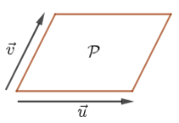
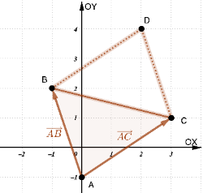

# Área de triângulos e paralelogramos

### Definição

 Dizemos que um paralelogramo  $\mathcal{P}$  tem lados $\vec{u}$ e $\vec{v}$  se um dos lados orientados de $\mathcal{P}$ for representante de $\vec{u}$  e o outro lado orientado de $\mathcal{P}$ for representante de $\vec{v}$.

### Proposição

 Se  $\vec{u}=\left(a_1,a_2\right)$  e   $\vec{v}=\left(b_1,b_2\right)$  são os lados de  um paralelogramo $\mathcal{P}$, como na figura acima, então a área de $\mathcal{P}$ é dada por

$$
  Área\mathcal{P} = \left| det
\begin{pmatrix}
- \ \vec{u} \ - \\
- \ \vec{v} \ -
\end{pmatrix}  \right| =  \left| det \begin{pmatrix}
a_1 & a_2 \\
b_1 & b_2
\end{pmatrix}  \right|.
$$

**Exemplo**

Determine a área do triângulo de vértices $A=(0,-1), \; B=(-1,2)$ e $C=(3,1)$.

- $\leftarrow$ Click para ver a solução
  
    A área do triângulo  $ABC$ é a metade da área do paralelogramo correspondente aos vetores (veja figura abaixo).
  
    $$
    \vec{AB}=B-A=(-1,3)  \\ \vec{AC}=C-A=(3,2)
    $$
    portanto, de acordo com a Proposição 1 acima,  sua área é dada por
    
  
    

    $$
    Área(ABC)=\frac{1}{2} \left| det \begin{pmatrix}
    \vec{AB} \\
    \vec{AC}
    \end{pmatrix}  \right| = \frac{1}{2} \left| det \begin{pmatrix}
    -1 & 3 \\
    3 &  2
    \end{pmatrix}  \right|= \frac{1}{2} \left|   -11 \right| = \frac{11}{2}.
    $$
    
