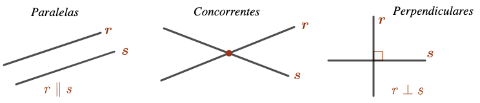

 # Equação Paramétrica de Reta

Destacamos as seguintes propriedades: 

*Por dois pontos distintos passa uma única reta.*
<!--

-->

Dadas duas retas distintas $r$ e $s$ temos duas possibilidades quanto sua interseção: 

1. *r e s não se intersectam, isto é, $r\cap s=\varnothing$.  Neste caso, r e $s$ são ditas paralelas ou com mesma direção e denotamos $r\parallel s$*
2. *r e s  se intersectam em um único ponto.Neste caso, $r$ e $s$ são ditas concorrentes.*

Duas retas concorrentes $r$ e $s$, formando ângulos de $90^{\circ}$ são ditas perpendiculares ou ortogonais e denotamos por $r\perp s.$

 Definição

 Dizemos que um vetor $\vec{u}$ é um vetor diretor ou um vetor paralelo a uma reta $r,$ e denotamos $\vec{u}\parallel r$ quando $\vec{u}$ pode ser representado sobre a reta $r,$ ou seja, quando existem dois pontos $A$ e $B$ da reta tais que $\vec{u} = \overrightarrow{AB}.$

<!--

-->

 **Proposição**

Fixados um ponto $P_0$ e um vetor $\vec{v}\ne\vec{0},$ existem infinitas retas paralelas a $r,$ mas existe apenas uma reta paralela a $\vec{v}$ que passa por $P_0.$

<!--

-->

Fixados um ponto $P_0$ e um vetor $\vec{v}\ne\vec{0},$ considere a única reta $r$ tal que $P_0\in r$ e $\vec{v}\parallel r.$     

Um ponto $P$ do plano pertence a reta $r$ se, e somente se, o vetor $P-P_0=\vec{P_0P}$  é múltiplo de $\vec{v}$, isto é, $P-P_0=t\vec{v}$, com $t\in\mathbb{R}$. Portanto, a reta $r$ é dada pela equação:

$$
r: P = P_0 + t \vec{v}, \quad t \in \mathbb{R}. \quad(\ast)
$$

**Observação:**  Na equação acima o ponto $P_0\in r$ e o vetor $\vec{v}\parallel r$ são constantes, pois eles foram fixados a priori, já o ponto $P$ e o número $t$ são variáveis, uma vez que $P$ percorre a reta $r$ a medida que $t$ percorre $\mathbb{R}$.  De fato, $P$  e  $t$  são variáveis dependentes uma da outra, pois para cada  $P\in r$  existe um único  $t\in \mathbb{R}$  que satisfaz a equação e vice versa.

 Definição

 Qualquer equação da forma $(\ast)$ é dita equação paramétrica de $r$. Neste caso, a variável $t$ é chamada de parâmetro da equação e o ponto $P_0$ e o vetor $\vec{v}$ são chamados de elementos fixos da equação.

**Observação:**  Existem infinitas equações paramétricas para uma mesma reta. De fato, existem infinitas possibilidades de escolha os elementos fixos e escolhas distintas   fornecem equações paramétricas distintas para a reta. Veja as Atividades e o Exemplo 2 abaixo.

Nesta atividade você pode ver a relação entre cada ponto de uma reta e seu correspondente parâmetro de acordo com diferentes escolhas dos elementos fixados.

Mova o ponto $P$ para ver sua relação com o parâmetro $t$.

  <iframe
    src="https://www.geogebra.org/material/iframe/id/xrejqcsh/width/800/height/500/border/888888/rc/false/ai/false/sdz/true"
    width="800"
    height="500"
    style="border:0;"
    allowfullscreen>
  </iframe>

Mova o ponto $P$ para ver sua relação com o parâmetro $t$. 

Vejamos como a equação paramétrica $r: P = P_0 + t \vec{v}, \ t \in \mathbb{R}$ fica usando coordenadas. 

Ponha $P=(x,y)$ e suponha que os elementos fixos da equação de $r$ são dados em coordenadas por  $P_0=(x_0,y_0)\in r$  e  $\vec{v}=(a,b)\parallel r$ .   Substituindo na equação acima, temos:

$$
r: \: (x, y) = (x_0,y_0) + t(a, b) = (x_0 + at , y_0+ bt), \ t\in \mathbb{R}.
$$

Igualando as coordenadas podemos reescrever a equação da forma

$$
\begin{array}{llr}
r:\left\lbrace \begin{array}{l}x={\color{993300}x_0}\; + \;{\color{D2691E}a}t \\
y={\color{993300}y_0}\; + \;{\color{D2691E}b}t  \\
\end{array} \right.,  \ \ t\in\mathbb{R}. &\ \ \ (\ast \ast)\\
\begin{array}{l}
 \ \ \ \quad \uparrow \; \ \quad \uparrow  \qquad  \uparrow \\
\ \  \quad P={\color{993300}P_0}+  t{\color{D2691E}\vec{u}}
\end{array} & & 
\end{array}
$$

No applet abaixo você pode alterar os elementos fixos das retas e verificar as suas respectivas equações paramétricas.

  <iframe
    src="https://www.geogebra.org/material/iframe/id/g8j8szyk/width/800/height/500/border/888888/rc/false/ai/false/sdz/true"
    width="800"
    height="500"
    style="border:0;"
    allowfullscreen>
  </iframe>

[geogebra/g8j8szyk](geogebra/g8j8szyk)

**Exemplo**

Verifique se os pontos que  $A=(-2,7)$  e  $B=(7,-2)$ pertencem a reta 

$$
r: \left\{
\begin{array}{l}
x = 1 + 3t \\
y = 2 - 5t
\end{array}
\right. , \ t \in \mathbb{R}.
$$

- $\leftarrow$ Click para ver a solução.
    
    Para um ponto pertencer a reta $r$ suas coordenadas devem satisfazer sua equação paramétrica para um **único** valor do parâmetro $t \in \mathbb{R}$. 
    
    Substituindo o ponto $A$ na equação de $r$ acima obtemos 
    
    $$
    \begin{array}{lcl}
    -2 = 1 + 3t & \Rightarrow &t=-1 \\
    7 = 2 - 5t & \Rightarrow & t=-1.
    \end{array}
    $$
    
    Como obtemos um único valor de t segue que $A\in r$.
    
    Substituindo o ponto $B$ na equação de $r$ segue que 
    
    $$
    \begin{array}{lcl}
    7 = 1 + 3t &\Rightarrow & t= -2\\
    -2 = 2 - 5t &\Rightarrow & t=\frac{4}{5}
    \end{array}
    $$
    
    Como obtemos dois valores distintos para $t$ temos que $B \notin r$.

**Exemplo**

Determine duas equações paramétricas para cada reta abaixo. 

1.  $\ell$ é a reta que passa pelo ponto $P_0=(2,1)$  e é paralela ao vetor  $\vec{u}=(1,-3)$;
2.  $m$ é a reta que passa pelos pontos $A=(-2,-1)$ e $B=(-1,2).$
- $\leftarrow$ Click para ver a solução
    
    Como sabemos, existem infinitas equações paramétricas para cada reta as quais dependerão da escolha de seus elementos fixos. 
    
    1. Para a reta $\ell$,  temos por exemplo:
        1. Substituindo os elementos fixos $P_0$ e  $\vec{u}$  nas equações $(\ast \ast)$  acima, obtemos
            
            $$
            \ell: \left\{
            \begin{array}{l}
            x = 2 + t \\
            y = 1 - 3t
            \end{array}
            \right. , \ t \in \mathbb{R}.
            
            $$
            
        2. Tomando o parâmetro $t=1$ na equação do item a., obtemos o ponto $P_1 =(3,-2)\in \ell$ e multiplicando o vetor $\vec{u}$ por $-2$ obtemos o vetor $\vec{v}= -2\vec{u}= (-2,6) \parallel \ell.$ Assim, usando os novos elementos fixos elementos fixos $P_1$ e $\vec{v}$ deduzimos a seguinte equação
            
            $$
            \ell: \left\{
            \begin{array}{l}
            x = 3 -2s \\
            y = -2 +6s
            \end{array}
            \right. , \ s \in \mathbb{R}.
            
            $$
            
    2. Para a reta $m$, temos por exemplo:
        1. Tomando como elementos fixos o ponto  $A=(-2,-1) \in m$  e o vetor  $\overrightarrow{AB}=B-A=(1,3)$ $\parallel m$, obtemos:
            
            $$
            m: \left\{
            \begin{array}{l}
            x = -2 + \mu \\
            y = -1 +3\mu
            \end{array}
            \right. , \ \mu \in \mathbb{R}.
            
            $$
            
        2. Tomando como elementos fixos o ponto  $B=(-1,2) \in m$  e o vetor  $\tfrac{1}{2}\overrightarrow{BA}=(-\tfrac{1}{2},-\tfrac{3}{2}) \parallel m$, obtemos:
            
            $$
            m: \left\{
            \begin{array}{l}
            x = -1 -\tfrac{1}{2} \nu \\
            y = 2 -\tfrac{3}{2}\nu
            \end{array}
            \right. , \ \nu \in \mathbb{R}.
            
            $$
            

