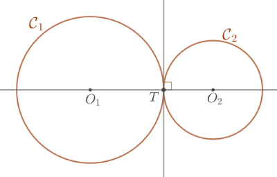

# Posição Relativa entre Círculos

::: {#def-posicao-relativa-circulos}
Dizemos que dois círculos  $\mathcal{C}_1$  e  $\mathcal{C}_2$  são:

- **disjuntos** se  $\mathcal{C}_1\cap\mathcal{C}_2=\emptyset$;
- **tangentes** em  $T$  se  $\mathcal{C}_1\cap\mathcal{C}_2=\{T\}$;
- **secantes** em  $A$  e  $B$  se  $\mathcal{C}_1\cap\mathcal{C}_2=\{A,B\}$.
:::

::: {#prp-circulos-tangentes}
Sejam  $\mathcal{C}_1$  e  $\mathcal{C}_2$  círculos tangentes em  $T$.

1. Se  $r$  é a reta que liga os centros dos círculos então  $T\in r$;
2. Se  $s$  é a reta perpendicular a  $r$  que passa por  $T$  então  $s$  é a reta tangente aos dois círculos no ponto  $T$.
    
    
:::
    

::: {#prp-posicao-relativa-circulos-distancia}
Dados dois círculos  $\mathcal{C}_1$  e  $\mathcal{C}_2$ de centro $O_1$ e $O_2$ e raio $r_1$ e $r_2$, respectivamente, temos que $\mathcal{C}_1$ e $\mathcal{C}_2$ são:

- **Disjuntos** se, e somente se,

$$
d(O_1,O_2) < |r_1 - r_2| \text{ ou } d(O_1,O_2) > r_1 + r_2 ;
$$

- **Tangentes** se, e somente se,

$$
d(O_1,O_2) = |r_1 - r_2| \text{ ou } d(O_1,O_2) = r_1 + r_2 ;
$$

- **Secantes** se, e somente se,

$$
|r_1 - r_2| < d(O_1,O_2) < r_1 + r_2 .
$$
:::

No exemplo iterativo abaixo, mova um círculo para visualizar os casos da proposição.


